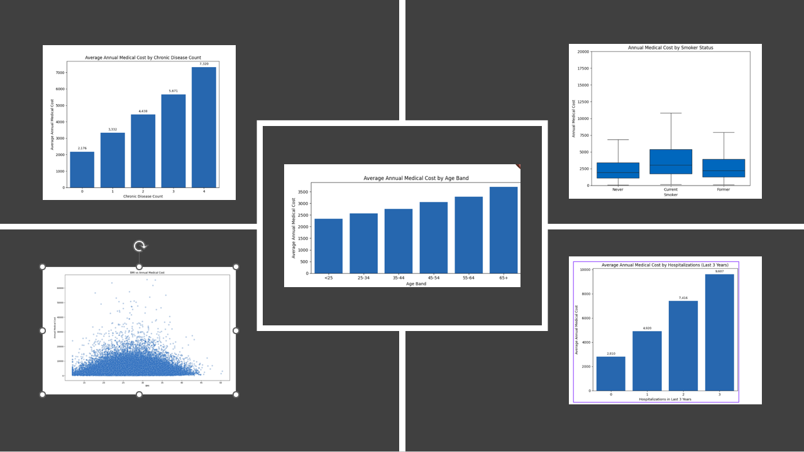
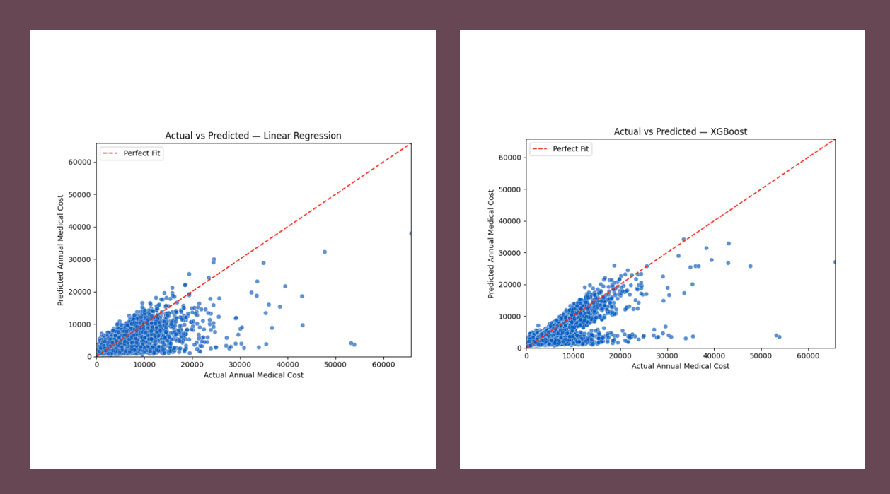
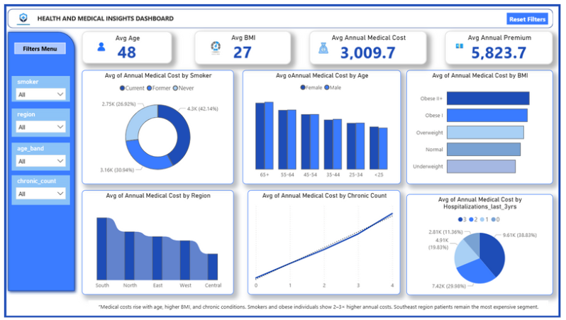
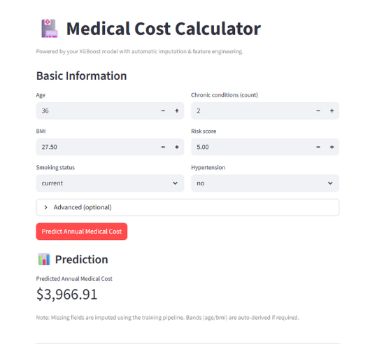

# Health Insurance Cost Analysis — U.S. Market Entry Support

**Author:** Sruthi Thulasi Das  
**Role:** Aspiring Data Analyst | Web Developer  
**Focus:** Data Analytics roles in Germany  
**Connect:** [LinkedIn](https://www.linkedin.com/in/sruthi-thulasi-das-547103152/) • [GitHub](https://github.com/Sruthi-t-das)

---

## 📌 Project Overview
This project analyzes **U.S. medical insurance costs** to identify key cost drivers and support **risk‑based premium pricing** for a potential market entry by *Allianz Germany*. The work combines **EDA**, **dashboard (Power BI)**, and **predictive modeling (Linear Regression, XGBoost)** to deliver actionable insights for **pricing and underwriting**.

### Stakeholder & Goal
- **Stakeholder:** Allianz Germany — *Pricing & Underwriting Team*  
- **Goal:** Design **fair and competitive premiums** that reflect health and demographic risk, **avoid underpricing** high‑risk profiles (smokers, obesity, chronic disease), and **attract low‑risk customers** with competitive offers. 

---

## 🧠 Hypotheses
1. **Smoking** significantly increases annual medical cost.  
2. **Higher BMI** leads to higher annual medical cost.   
3. **Age** is positively correlated with cost.   
4. **Chronic disease count** increases cost.   
5. **Hospitalizations (past 3 years)** increase cost. 

---

## 📊 Dataset
- **Source:** U.S. Medical Insurance dataset  
- **Size:** **100,000** records  
- **Features:** **7** attributes (demographics, lifestyle, and health indicators)  
- **Target:** `annual_medical_cost`  
Focus: combine **demographic + lifestyle + health** factors to predict yearly medical cost. 

> 

---

## 🛠️ Tools & Tech
- **Python** (EDA & Modeling): pandas, numpy, scikit‑learn, matplotlib/xgboost  
- **Dashboards:** **Power BI** (interactive exploration & risk segmentation)  
- **App:** **Streamlit** for showcasing predictions (prototype) 


---

## 🧪 Methodology
1. **EDA & Cleaning**: outlier checks, missing values, feature engineering (e.g., BMI bands).  
2. **Visualization**: smoker vs non‑smoker costs, BMI bands vs cost, age groups, chronic disease count, hospitalizations.  
3. **Modeling**:  
   - **Linear Regression** (baseline): **MAE ≈ 1,430**, **R² ≈ 0.44**.  
   - **XGBoost** (advanced): **MAE ≈ 943.6**, **R² ≈ 0.631**, capturing non‑linear effects.   
4. **Interpretation**: **Smoking, BMI, and Chronic Disease Count** emerge as strongest predictors. 

---

## 🔍 Key Findings
- **Smoking** is a **dominant cost driver**; smokers show higher median and upper‑quartile costs and more high‑cost outliers.     
- **BMI** shows a **moderate positive** relationship with cost; variance widens in obese bands → greater unpredictability.     
- **Age** correlates **positively** with cost; **65+** is the highest‑cost segment.     
- **Chronic illnesses**: each additional chronic disease substantially **raises** average costs.     
- **Hospitalizations**: frequent stays drive **sharp cost escalation**.  





---

## 📈 Dashboard & App
- **Power BI** dashboard enables filtering by **smoker status, region, age, chronic conditions** and dynamic cost comparisons across risk groups.     
- **Streamlit** app demonstrates single‑record **cost prediction** and scenario exploration (prototype).   




---

## 🧭 Recommendations (Pricing & Product)
- Apply **higher premiums for smokers** with “**Quit & Save**” incentives to encourage cessation.     
- Use **BMI** as a **moderate** risk factor and add **wellness discounts** for healthy weight maintenance.     
- Implement **age‑tiered pricing** and **senior‑focused** preventive coverage.     
- Include **chronic‑care management** and **health monitoring** benefits.     
- Offer **post‑hospital recovery** plans and preventive care initiatives.   

**Market Entry Approach:** Start with **selective premium strategies** to undercut high national averages; focus on **low‑risk segments** initially to build trust & profitability.   

---

## 📂 Suggested Repository Structure
```
├── data/                     # (optional) raw/processed data or data loading script
├── notebooks/                # EDA & modeling notebooks
├── src/                      # python package for data prep & models
│   ├── data_prep.py
│   ├── features.py
│   ├── train_linear.py
│   └── train_xgb.py
├── app/                      # streamlit app
│   └── app.py
├── dashboards/               # Power BI files (.pbix) or exports
├── assets/                   # images for README (charts, dashboard screenshots)
└── README.md
```

